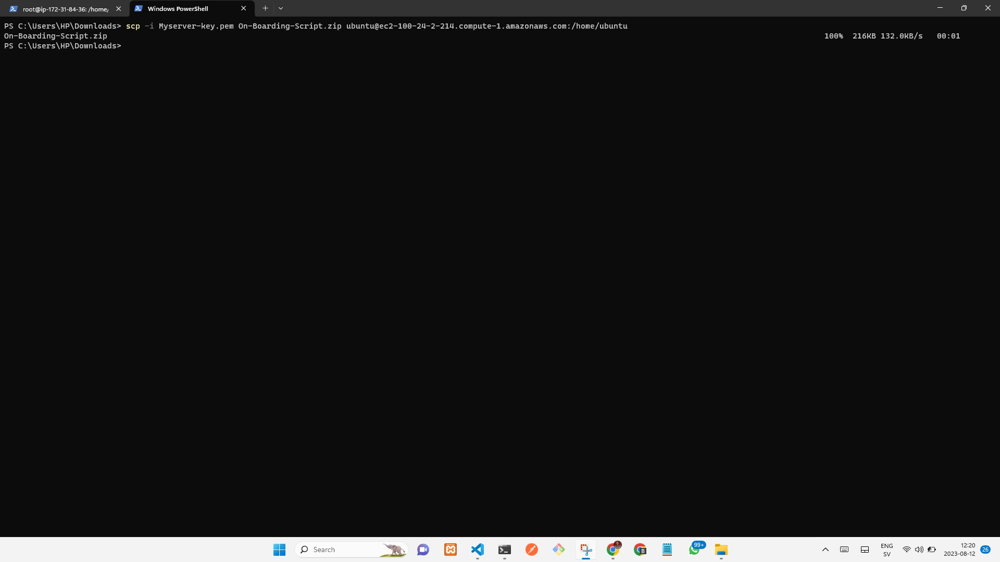
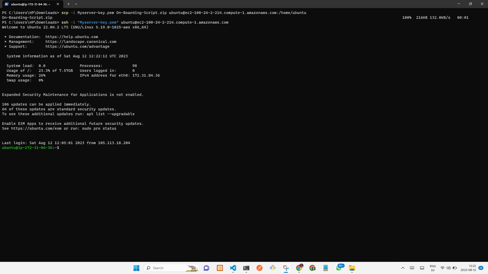
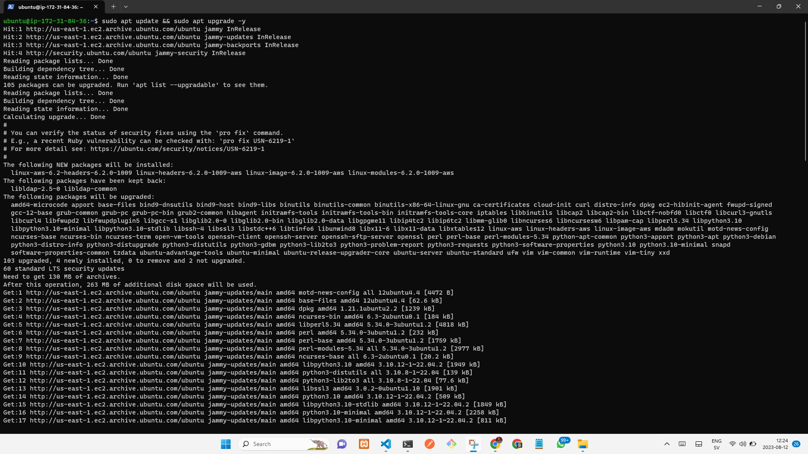
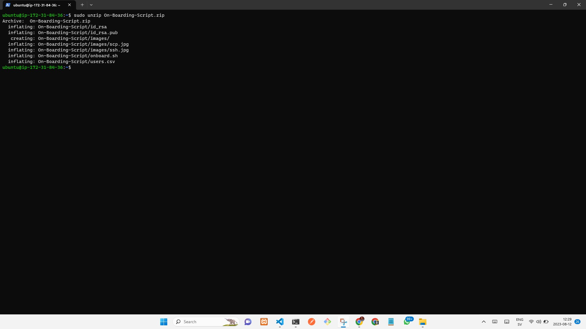
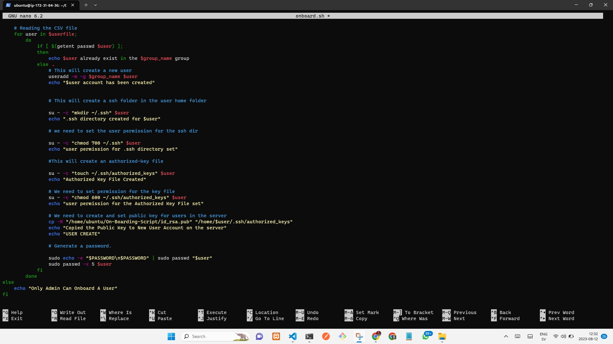
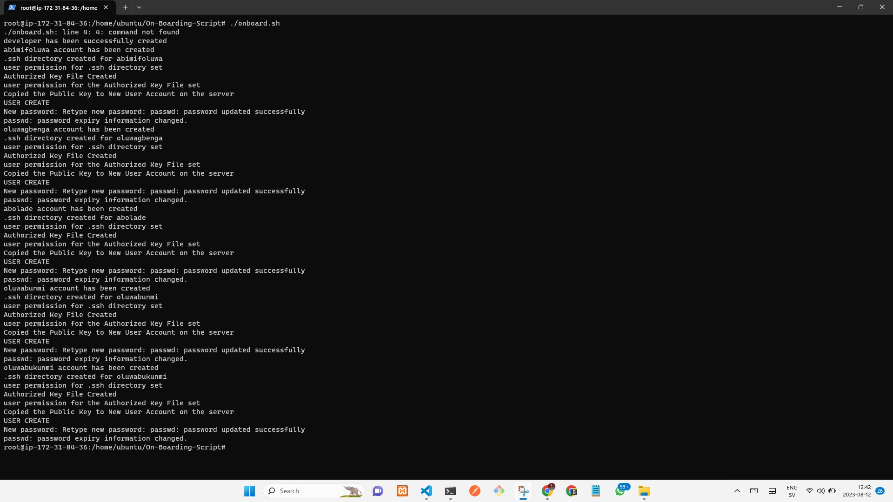
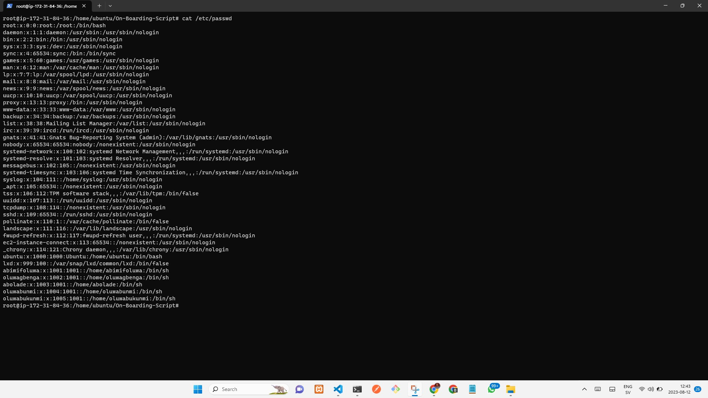

## Shell Script To Onboard 20 Users

<h3>Introduction to Shell Scripting</h3>

Shell scripting is a way to automate and control the execution of various tasks and commands on a computer through the command-line interface (CLI). It involves writing a series of commands in a text file (the shell script) that can be executed by the operating system's shell interpreter. Shell scripts are primarily used to automate repetitive tasks, manage system configurations, and streamline various processes.

<h3>Components of Shell Scripting </h3>

<b>Commands:</b> Shell scripts are composed of various commands, utilities, and functions that perform specific tasks, such as file manipulation, text processing, and system management.

<b>Variables:</b> Shell scripts use variables to store and manipulate data. These variables can hold values, such as file paths, user input, or numeric data.

<b>Control Structures:</b> Shell scripts employ control structures like loops (for, while) and conditional statements (if, else) to create decision-making processes and repeat actions.

<b>Functions:</b> Functions allow modularization of code, promoting code reusability and maintainability.

<b>Input and Output:</b> Shell scripts can take input from users or files and produce output to the terminal or files.

## Script Functions and problems to solve

1. This script will read a CSV file that contains 20 new Linux users.
2. This will check fof the existence of a group called 'developer' and create a new one if not exist.
3. The script will create each user on the server and add them to the group'developers'.
4.  This script will first check for the existence of the user on the system, before it will attempt to create
5. The user that is being created also must have a default home folder
6. Each user would have a .ssh folder within its HOME folder. If it does not exist, then it will be created.
7. For each user's SSH configuration, We will create an authorized keys file from an existing SSH Keys

For the purpose of the pratical work, I will be using Ubuntu 22.04 through AWS Elastic Cloud Compute (EC2) as my sever. 

After spining up an EC2 instance, before connecting the server romotely through SSH we have to send a zipped folder containing shell script, id_rsa, id_rsa.pub, and the file contaibing the users to onboard in CSV format. To do this, we have to use "SCP" command with the ec2 instance pubulic ip, username, and pem key.

     scp -i Myserver-key.pem On-Boarding-Script.zip ubuntu@ec2-100-24-2-214.compute-1.amazonaws.com:/home/ubuntu

 

After sending the zipped folder, the next step is to connect to the server via SSH

    ssh -i "Myserver-key.pem" ubuntu@ec2-100-24-2-214.compute-1.amazonaws.com

 

Now, we update and upgrade our server

    Sudo apt update && sudo apt upgrade -y

 

Then, we need to check the zipped file we sent is already there

    ls

 

To access this zip folder, we need to install the unzip package

    sudo apt install unzip

 

Now, we will unzip the file

    sudo unzip On-Boarding-Script.zip

 

Do comfirm this, we will list out items in the directory once again

    ls

Next, we navigate in to the "Boarding-Script" directory

    cd Boarding-Script

Once thta is done, then we print the cuurnet directory path and copy it because we it in the shell file.

    pwd

next is the edit the onboard.sh file

    sudo nano onboard.sh

 

Once the path has been chenged, we change into root user

    sudo su

Before running the shell, it ia appropriate to grante the onboard.sh execute permission

    sudo chmod +x onboard.sh 

then run the shell

    ./onboard.sh

 
 
 To confirm this, we will cat the /etc/passwd directory for the available users

    sudo cat /etc/passwd

 

## Conclusion
We've successfully written and onboarded 20 users script. The images shows that the 20 users have been successfully added.