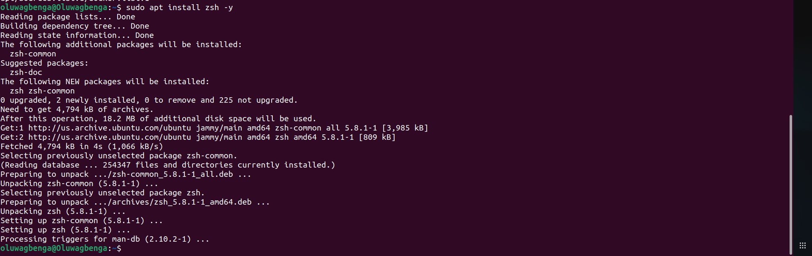
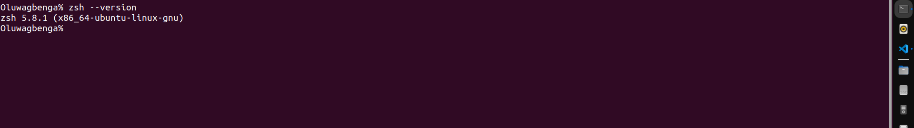
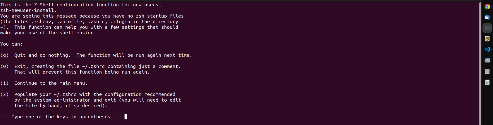
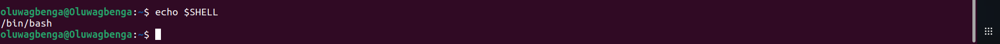
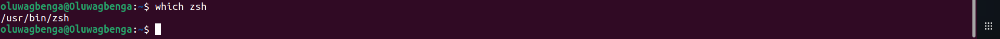

### INDUCTION TO ZSH
The Z Shell, commonly known as Zsh, is a versatile and interactive Unix shell that serves both as an engaging command interpreter and a powerful tool for shell scripting. Originating as an extended iteration of the Bourne shell, Zsh incorporates numerous enhancements inspired by features found in Bash, ksh, and tcsh.

One of the distinctive features of Zsh lies in its rich array of benefits. Users can enjoy advanced command-line completion, streamlining their interaction with the shell. Additionally, Zsh boasts a shared history functionality, facilitating seamless navigation through previously executed commands. The globbing capability has been improved, providing users with more flexibility in pattern matching.

Intelligent tab completion is another noteworthy attribute of Zsh, enhancing the efficiency and ease of command input. The shell also includes a spell correction feature, minimizing errors by suggesting corrections for mistyped commands. Furthermore, Zsh offers a diverse set of plugins and themes, allowing users to customize their shell environment to suit their preferences and workflow.

In essence, Zsh stands as a comprehensive and user-friendly Unix shell, combining the strengths of various shells and introducing novel features to elevate the overall command-line experience for users engaged in both interactive sessions and shell scripting endeavors.


I'm going to guide you through the process of installing and configuring the Z Shell application on an Ubuntu Linux machine to enhance and improve your bash scripting. Kindly follow along, and do not hesitate to stop at any point you feel satisfied with your configuration. Below are the prerequisites required for the setup:

- An Ubuntu linux operating syswtem (OS)
- A active terminal `Press ctl+alt+T`
- A user account with root previledges.

As a best practice, it is right to update or even upgrade your machinbe before syarting activity.
```
sudo apt update && sudo apt upgrade -y
```

Follow by installing the application.
```
sudo apt install zsh -y
```


You can confirm installation by checking the verrsion of the zsh installoed with the command
: `zsh --versiion`


#### Configuration
Unlike other shell terminal, Z Shell requires initial cinfiguration when you start bit for the first time. To do this, you only njeed to type`zsh` and then press Enter


 Follow the prompt on the terminal to configure it as you want.

#### makinging Zsh the default shell terminal
 Firstly before make the Zsh we installed the default terminal, we need to check what is the active default terminal. To do this, type
 ```
 echo $SHELL
 ```
 

 Since it has been confirmed that bash is the default terminal, we change it using the change shell command `chsh`
 ```
chsh -s [zsh's path] [user]
 ```
 Not assigning a user will only make the defaukt change wirk fir the current user only. To get the path/location of zsh, we will use `which`. As used below:

 ```
 which zsh
 ```
 
 
